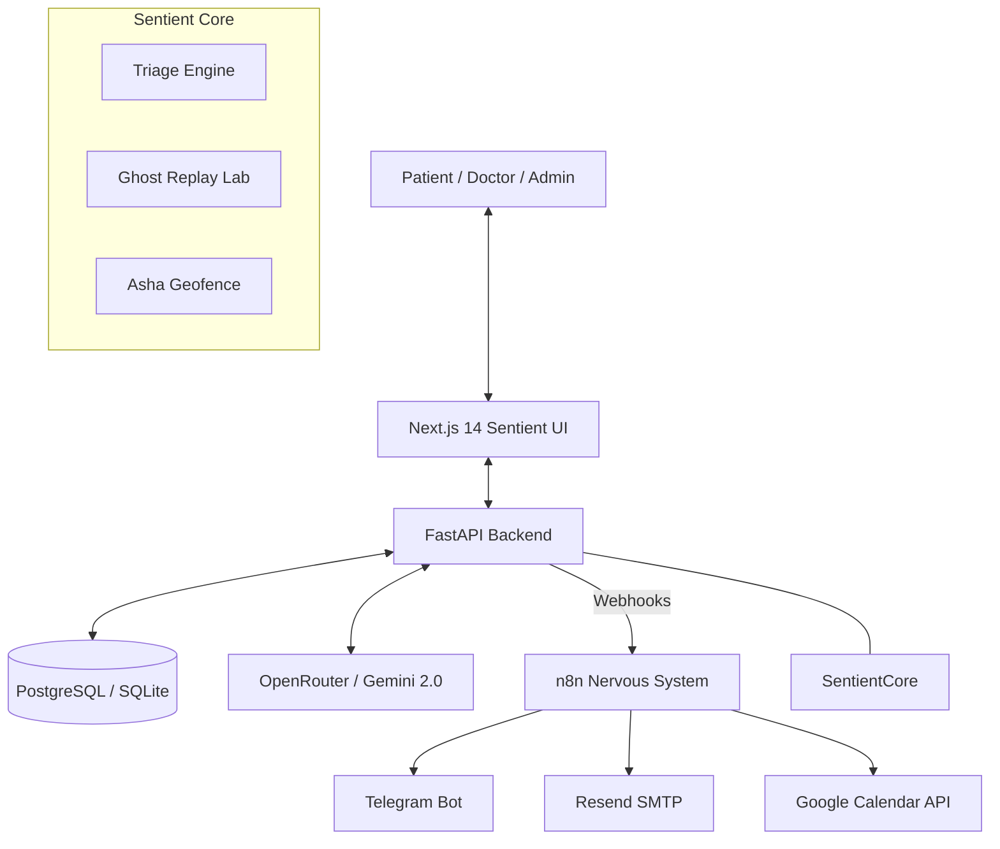

# Dignova AI — Sentient OS Layer for Healthcare

Dignova AI is a high-fidelity, autonomous healthcare intelligence system designed to act as a **"Sentient Layer"** between patients and medical institutions. Operating as an OS for healthcare, it passively observes, orchestrates, and automates the entire clinical lifecycle—from initial triage to autonomous logistics and proactive aftercare.

---

## 📖 Table of Contents
- [Project Overview](#-project-overview)
- [Core Features](#-core-features)
- [Architecture & Data Flow](#-architecture--data-flow)
- [Tech Stack](#-tech-stack)
- [Installation & Setup](#-installation--setup)
- [Environment Variables](#-environment-variables)
- [Security & Privacy](#-security--privacy)
- [Visual Language](#-visual-language)
- [Notes & Assumptions](#-notes--assumptions)

---

## 🏥 Project Overview
Dignova AI solves the "Clinical Bottleneck" by introducing an autonomous intelligence layer that handles repetitive medical logistics, allowing doctors to focus on critical care.

### User Roles & Workflows
- **Super Admin:** Global platform management, organization bootstrapping, and multi-tenant performance monitoring.
- **Organization Admin:** Hospital-specific management, staff registry, department orchestration, and "AI Philosophy" configuration (Aggressive vs. Balanced triage).
- **Doctor (Experienced/Mid-range):** Real-time triage intervention, case review, and authoring "Ghost Replay" scenarios for training.
- **Intern:** Practices clinical reasoning in the **Neural Training Lab**, simulating triage against expert-authored scenarios with AI-powered performance evaluations.
- **Patient:** Onboards via a "Sentient Welcome" flow, reports symptoms via text/voice, receives autonomous prescriptions, and experiences proactive aftercare.

---

## ✨ Core Features

### 1. Sentient Triage Matrix
- **Multimodal Ingestion:** Supports text and **Voice Notes** (OpenAI Whisper) via Web or Telegram.
- **Real-time AI Assessment:** Powered by Gemini 2.0, analyzing symptoms, extracting "Red Flags," and assigning clinical risk levels (Low, Elevated, Critical).
- **Autonomous Routing:** Low-risk cases trigger auto-prescriptions; high-risk cases escalate to online doctors with interactive Telegram "Inline Approval" cards.

### 2. Neural Ghost Replay (Intern Training)
- **Clinical Simulation:** Interns "play back" real historical cases, chatting with an AI-driven patient persona.
- **AI Evaluation Engine:** Intern diagnoses are analyzed for alignment with the "Expert Gold Standard" using keyword-based NLP similarity.
- **Skill Matrix Tracking:** Tracks diagnostic accuracy, clinical reasoning, and treatment planning across levels (Novice to Expert).

### 3. Asha Geofencing & Logistics
- **Queue Bypass:** Detects when a patient enters a 500m radius of the hospital via live location telemetry and automatically prepares the clinic for arrival.
- **Smart Reminders:** Autonomous Google Calendar synchronization and smart Telegram reminders for appointments.

### 4. Zero-Touch Prescription & Aftercare
- **Automated Delivery:** Secure PDF prescription generation and delivery via encrypted digital vaults.
- **The Empathy Loop:** Automated "Aftercare Pings" on Day 3 post-consultation to track recovery and flag potential complications back to doctors.

---

## 🏗 Architecture & Data Flow

Dignova operates through a **Unified Sentient Core** that connects the Frontend (Identity), Backend (Reasoning), and n8n (Agency).



---

## 🚀 Tech Stack

- **Frontend:** Next.js 14, React Three Fiber (3D Monolith), GSAP & Framer Motion (Sentient Animations), Tailwind CSS.
- **Backend:** FastAPI, SQLAlchemy (Async), PostgreSQL/SQLite, Pydantic.
- **Automation:** n8n (Production Grade Workflow Engine).
- **AI Brain:** OpenRouter (Gemini 2.0 Flash), OpenAI Whisper (Audio).
- **Security:** AES-256 Symmetric Encryption, JWT Auth, SlowAPI (Rate Limiting).
- **Logistics:** Resend API (Email), Google Calendar API, Telegram Bot API.

---

## 🛠️ Installation & Setup

### 1. Prerequisites
- **Node.js:** v18+
- **Python:** 3.10+
- **n8n:** Self-hosted or Cloud (exposed via Ngrok/Localtunnel if local).

### 2. Backend Setup
```bash
cd backend
python -m venv venv
source venv/bin/activate  # Windows: venv\Scripts\activate
pip install -r requirements.txt
cp app/env.example .env   # Update with your API keys
python seed.py            # Bootstrap Organizations and Super Admin
python run.py             # Starts Backend on Port 8000
```

### 3. Frontend Setup
```bash
cd frontend
npm install
npm run dev               # Starts Frontend on Port 3000
```

### 4. n8n Nervous System
1. Import all JSON workflows from `n8n_workflows/`.
2. Configure credentials for Telegram, Resend, and Google.
3. Update webhook URLs to match your local tunnel (Ngrok) or production domain.

---

## 🔑 Environment Variables

Required variables in `backend/.env`:
```env
DATABASE_URL=sqlite+aiosqlite:///app/app.db
JWT_SECRET_KEY=your_secret_key
GEMINI_API_KEY=your_openrouter_key
RESEND_API_KEY=your_resend_key
N8N_BASE_URL=https://your-n8n-instance.com
ADMIN_EMAIL=admin@dignova.ai
ADMIN_PASSWORD=admin123
HOSPITAL_LAT=17.4486
HOSPITAL_LON=78.3908
```

---

## 🔒 Security & Privacy
- **HIPAA-Inspired Encryption:** Sensitive fields (`address`, `medical_notes`, `transcripts`) are symmetrically encrypted using AES-256 before storage.
- **Zero-Trust Auditing:** Every sensitive clinical or admin action is logged in the `audit_logs` table with IP and User metadata.
- **Rate Limiting:** Protects sensitive routes (Login/Triage) from brute-force and DDoS attacks.

---

## 🎨 Visual Language
- **The Monolith:** A majestic 3D octahedron representing the AI brain, reacting to system state.
- **Sentient Motion:** GSAP-driven transitions that simulate a living OS layer.
- **Glassmorphism:** High-fidelity UI cards with noise overlays for a cinematic feel.

---

## 📝 Notes & Assumptions
- **Connectivity:** Assumes stable internet for AI reasoning; features "Survivor Mode" for optimized low-bandwidth Telegram interactions.
- **Tunnels:** For local development, use `ngrok` to expose both the Backend (8000) and n8n (5678) to receive Telegram and Resend webhooks.

---
© 2026 Dignova AI — Autonomous Healthcare Intelligence.
