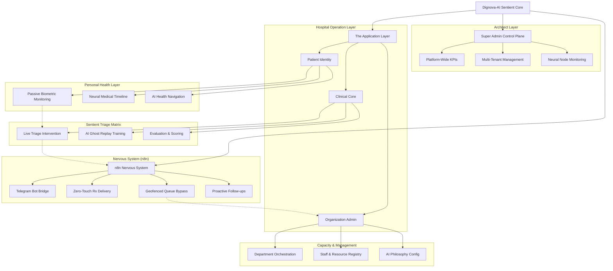

# Dignova-AI: Sentient OS Architecture Flow

This flowchart illustrates the multi-layered architecture of **Dignova-AI**, designed to explain the "Sentient OS" philosophy to judges. It highlights how the AI core interacts with different user roles and the autonomous "Nervous System" (n8n).

## Layer Explanation for Judges

### 1. The Sentient Core (Root)
Unlike traditional healthcare apps, Dignova operates as an **OS Layer**. It doesn't just store data; it passively observes and orchestrates.

### 2. The Super Admin (The Architect)
The "Brain" for the entire platform. It manages the multi-tenant environment, allowing hundreds of hospitals (Organizations) to run their own isolated sentient environments while monitoring global platform health.

### 3. The n8n Nervous System (The Automation)
The "Nerves" of the system. This layer handles autonomous agency—tasks that happen while the doctor is away.
*   **Telegram Bridge**: Real-time patient alerts directly to doctors' pockets.
*   **Geofence**: Detects when a patient enters the hospital premises to automatically check them in.
*   **Proactive Aftercare**: Automatically checks on patients 3 days after a visit.

### 4. The Clinical Core (The Medical Brain)
Where AI and Human Expertise merge.
*   **Live Triage**: AI analyzes symptoms in real-time, highlighting "Critical" cases for immediate human intervention.
*   **Ghost Replays**: A world-first training system where interns "play back" real historical cases to train their clinical reasoning against an AI gold standard.

### 5. Patient Identity (The Individual)
The "Cells" of the system.
*   **Passive Monitoring**: Captures vitals and uses "Emotional Telemetry" (typing cadence/jitter) to detect patient stress.
*   **Neural Timeline**: A living record of every medical event, prescription, and triage call.
